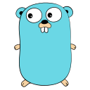
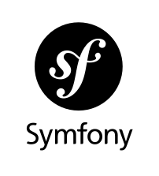

# hi, i'm lumetas
## PHP-backend developer

### A Bit More About Me

PHP developer with a passion for backend logic and databases. I enjoy turning complex requirements into simple, efficient code. Outside of coding, I'm probably deep in configuring **Neovim** to perfection (it's a never-ending journey!).

- Fun fact: I chose PHP for its simplicity and power, and I'm still here, building robust applications and enjoying the ecosystem.
- How to reach me: [telegram](https://t.me/lumetas) or [email](mailto:lumetas506@gmail.com)

### Pet Projects

- **[luper](https://github.com/lumetas/luper)** — Library for parallel operations in PHP (processes, threads, fibers)
- **[meract](https://github.com/meract/meract)** — Lightweight micro-framework for PHP
- **[ldoc](https://github.com/meract/ldoc)** — Markdown documentation generator from PHP docblocks
- **[trilium-notes](https://github.com/Lumetas/TriliumNotes)** - PHP client for Trilium Notes ETAPI.
- **[Goliaff](https://github.com/Lumetas/Goliaff)** - Declarative Linux System Configuration Manager.

 

<h3 align="left">Connect with me:</h3>

 
<h3 align="left">Languages and Tools:</h3>

 
 
 
 
 
 
 
 
 
 
 
 
 
 
 
 

<!---->
<!-- `██╗     ██╗   ██╗███╗   ███╗███████╗████████╗ █████╗ ███████╗`  -->
<!-- `██║     ██║   ██║████╗ ████║██╔════╝╚══██╔══╝██╔══██╗██╔════╝`  -->
<!-- `██║     ██║   ██║██╔████╔██║█████╗     ██║   ███████║███████╗`  -->
<!-- `██║     ██║   ██║██║╚██╔╝██║██╔══╝     ██║   ██╔══██║╚════██║`  -->
<!-- `███████╗╚██████╔╝██║ ╚═╝ ██║███████╗   ██║   ██║  ██║███████║`  -->
<!-- `╚══════╝ ╚═════╝ ╚═╝     ╚═╝╚══════╝   ╚═╝   ╚═╝  ╚═╝╚══════╝`  -->
